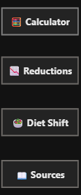

# **🌍 Eco Footprint Visualizer**
## **Project Overview & Methodology**

The Eco Footprint Visualizer is an interactive data visualization project designed to quantify how dietary choices—particularly shifts toward plant-based nutrition—impact the environment.

The tool translates food consumption data into five core environmental dimensions:

    🌡️ Greenhouse Gas Emissions (GHG)

    💧 Water Use

    🌾 Land Use

    🐾 Animal Lives Impacted

By connecting individual food choices to system-level environmental outcomes, the project enables users to:

- Understand the real environmental cost of modern diets

- Explore the potential benefits of plant-based transitions

- Visualize the real-world scale of collective action

- Trust the model through transparent scientific sourcing

## **Project Structure**
### **The Menu**
A persistent navigation menu is located on the left side of the dashboard.

Users can easily change pages within the project.

### **📄 Page 1 — Calculator**

*“How does the environmental impact of a plant-based diet change as more people adopt it?”*

This page serves as the analytical core of the project, allowing users to simulate how dietary choices affect the environment in real time. It lets you choose how many people are shifting toward a plant-based diet before seeing the environmental impact.

Instead of using just one slider for all possible population sizes, this page separates population into three clear groups:

    Community – a few people up to a small town
    
    National – a city up to a whole country
    
    Continental – millions to billions of people

This makes it much easier to understand and control changes at very different scales.

**🔘 How the Buttons Work**

Each group has a button. When you click one:

- Only the matching population slider becomes active

- The other two are turned off

- All calculations use only the selected scale

This prevents numbers from mixing or overlapping and keeps the results accurate.

**🎚️ What the Sliders Do**

Each scale has its own slider:

- Community slider → small numbers (up to 10,000)

- National slider → medium numbers (up to 5 million)

- Continental slider → very large numbers (millions to billions)

This lets you:

- Test what happens if a village changes

- Compare it to a full country

- Then explore global-scale change

**🌱 Plant Shift Slider**

The Plant-Shift % slider controls how much of the population changes their diet.

**🧠 What This Page Helps You Understand**

This page shows that:

- The same personal choice can have very different results at different scales

- Small changes at the community level grow into huge environmental effects at national and global levels

- Sustainability is not just about what people do, but also about how many people do it.

---
### **📄 Page 2 — Visuals**

*“What does environmental improvement look like at scale?”*

This page converts abstract environmental units into human-scale visual equivalents, transforming data into meaning.

**🎯 Core Purpose of Page 2**

- Make large environmental numbers tangible

- Translate reductions into recognizable physical objects

- Show that collective behavior creates visible outcomes

Preset Plant Shift % and Number of People values demonstrate how moderate individual change creates massive group impact.

---
### **📄 Page 3 — Diet Shift**

*“How does your diet actually change as you move toward a more plant-based lifestyle?”*

This page explains the behavioral mechanism behind the impact.

**🎯 Core Purpose of Page 3**

- Make the diet transition transparent

- Show which foods decrease and which increase

- Prove that benefits come from traceable substitutions

It directly connects:

Human behavior → Food demand → Environmental impact

**🔧 User Controls on This Page**

    Plant Shift % Slider

    Food Group Selector

Users can:

- Compare baseline vs shifted diets

- Focus on individual food groups

- Observe changes at any transition level

This page explains:

- How the reductions from Pages 1–2 actually happen

- Which foods matter most

- How the grocery basket transforms at 50%, 75%, or 100% plant-based

---
### **📄 Page 4 — Sources & Methodology**

*“Where does the data come from, and why can this model be trusted?”*

This page forms the scientific foundation of the entire project.

**🎯 Core Purpose of Page 4**

- Establish scientific credibility

- Document sources and methods

- Ensure transparency and reproducibility

**📚 What Is Documented**

**1. Environmental Impact per Food Group**

Each food group includes:

- GHG emissions (kg CO₂e/kg)

- Land use (m²/kg)

- Water use (L/kg)

- Primary scientific source

Key sources include:

    Poore & Nemecek (2018, Science)

    Mekonnen & Hoekstra (2012, Water Footprint Network)

    FAO / FAOSTAT

    USDA ERS & USDA NASS

This validates all environmental calculations on Pages 1–3.

**2. Animals Slaughtered per Person per Year**

Documents average animals killed per person.

By species:

- Beef

- Pork

- Poultry

- Eggs

- Fish

- Dairy

Based on:

    USDA ERS

    USDA NASS

    FAO

    Industry statistics

This powers the Animals Slaughtered metric on Page 1.

**3. Tooltip Citations & Visual References**

Interactive tooltips provide:

- Exact study names

- Institutional sources

- Peer-reviewed validation

---
### **⚙️ How This Project Was Built**
The primary data source for this project is the Excel model provided by the Game Changers Institute, which contains the original environmental calculations and food group structures.

In addition, a reference Power BI (.pbix) file was provided to ensure:

- The logic of the visualizations was preserved

- The sustainability framework remained scientifically consistent

- The calculator aligned with institutional methodology

### **🔧 Modifications from the Original Power BI File**
Two major extensions were introduced:

**1. Measures Added**

Compared to the original measures, several new calculations were added, the most important being:

**a) Converted KPI Measures**
    
To make impacts scalable and suitable for population-level analysis:

    GHG: kg → tonnes

    Water: kL → ML

    Land: m² → hectares

Used in Page 1 — Negative Impact.

**b) Baseline and Updated Consumption**

Used in Page 3 — Diet Shift to compare:

    Regular diet

    Diet adjusted by Plant Shift %

---

**2. Tables Added**

Source tables were extracted from the Excel model and displayed on Page 4 — Sources.

This prevents overcrowding analytical pages while maintaining full transparency.

---
### **🧭 How to Use the Eco Footprint Visualizer**

This dashboard is fully interactive and designed for intuitive exploration. Users can simulate dietary shifts, scale environmental impacts, and verify all scientific sources used in the model. While basic guidance is built into the dashboard, the instructions below ensure correct and efficient use.

**🗂️ 1. Navigate the Project Using the Left-Side Menu**

The navigation menu is visible on every page and allows instant access to:

    Calculator
    
    Reductions

    Diet Shift
    
    Sources

How to use:

- Hover over the desired page.

- Press CTRL + Click to navigate.

This allows:

- Seamless storytelling flow

- Fast comparison between impact, behavior, and methodology

---
**🎚️ 2. Adjust the Diet with the Plant Shift % Slider**

Available on: Page 1 (Calculator) & Page 3 (Diet Shift)

How to use:

- Click and drag the slider to the desired percentage.

Function:

- 0% → Regular mixed diet (includes both animal- and plant-based foods)

- 100% → Fully plant-based diet

This dynamically updates:

- Environmental impacts (Page 1)

- Food consumption patterns (Page 3)

---
**👥 3. Scale the Impact with the Number of People Slider**

Available on: Page 1 (Calculator)

How to use:

- Click and drag the slider

- Or click inside the number box and manually enter a value

This allows simulation of:

- Individual-level change

- Community-level impact

- Institutional or city-scale scenarios

All environmental metrics scale automatically with this input.

---
**🧩 4. Filter by Food Group**

Available on: Page 3 — Diet Shift

How to use:

- Click one or multiple food groups to filter results.

- To reset and view all food groups, deselect the currently selected items.

This enables focused analysis of how specific foods drive environmental impact and dietary change.

---
**📚 5. Verify All Data on Page 4 — Sources & Methodology**

Every metric in the dashboard is fully documented on the Sources page, including:

- Environmental impact per food group (GHG, Water, Land)

- Animals slaughtered per person per year

- Scientific citations and institutional datasets

How to use:

- Hover over values to view tooltip-based source references directly inside the dashboard.

This ensures full transparency, traceability, and scientific credibility.

---
### **✅ Conclusion — Why This Project Matters**

The Eco Footprint Visualizer transforms food choices from an abstract sustainability concept into a measurable, visual, and actionable system.

It shows that:

- Environmental damage is not distant — it is calculated

- Individual behavior scales into global consequence

- Dietary change is one of the most powerful climate & biodiversity tools available

- Sustainability decisions can be driven by transparent, scientific data

This project bridges the gap between science, personal responsibility, and collective action.

